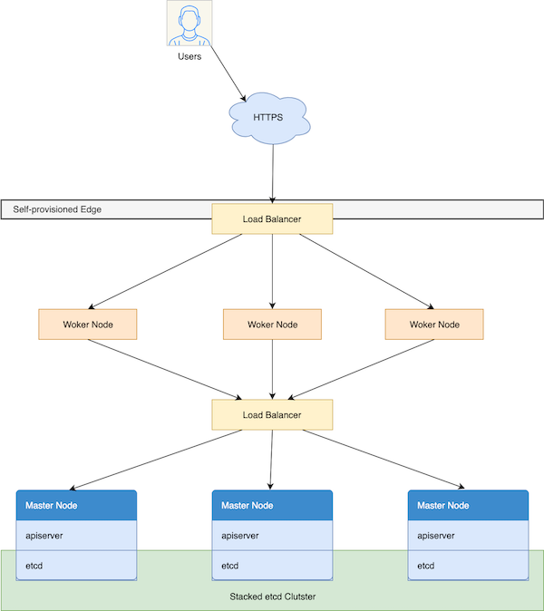
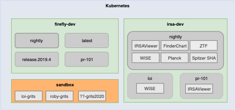

# IRSA Kubernetes: Deploy an application

A tutorial on how to deploy an application to IRSA Kubernetes

- git clone https://github.com/loitly/grits2020

## Objectives

- Create a simple Apache web server deployment
- Deploy it to the cluster
- Expose it to the outside world

## What you will learn

- Basic understanding of Kubernetes’s core components and its concepts
- `kubectl`: A command line tool that lets you manage Kubernetes clusters

&nbsp;  
## Before we begin

### What is IRSA Kubernetes

  

&nbsp;  
### Virtual Cluster

Kubernetes supports multiple virtual clusters backed by the same physical cluster. These virtual clusters are called namespaces.

  

&nbsp;  
### kubectl

`kubectl` is a command line tool for to managing Kubernetes cluster(s)

#### Install with Homebrew on macOS    
    
    $ brew install kubectl
    
#### Configure kubectl

In order for `kubectl` to find and access a Kubernetes cluster, it needs a kubeconfig file. 
Kubeconfig files are used to organize information about clusters, users, namespaces, and authentication mechanisms.  
By default, `kubectl` looks for a file named `config` in the $HOME/.kube directory.
A temporary kubeconfig file is created and made available here: irsadev:/home/loi/grits2020/config  

    $ scp irsadev:/home/loi/grits2020/config ~/.kube/
    $ kubectl get ns
    NAME              STATUS   AGE
    default           Active   77d
    firefly-dev       Active   77d
    firefly-ops       Active   77d
    ingress-nginx     Active   77d
    irsa-dev          Active   77d
    irsa-ops          Active   77d
    kube-node-lease   Active   77d
    kube-public       Active   77d
    kube-system       Active   77d
    sandbox           Active   22h

    

&nbsp;  
## Define your deployment

- Instructs Kubernetes how to create and update instances of your application.
- Kubernetes continuously monitors these instances
- If an instance goes down, it will be replaced with a new one.   (self-healing mechanism)

From [deploy.yml](deploy.yml)

#### Deployment

    apiVersion: apps/v1
    kind: Deployment
    metadata:
      # The name of the deployment
      name: grits-loi
      namespace: sandbox
      labels:
        # label placed on the Deployment
        app: grits-loi
    spec:
      # defines how the Deployment finds which Pods to manage   (*)
      selector:
        matchLabels:
          app: grits-loi
      # number of Pod or instances to create
      replicas: 2
      template:
        metadata:
          # label placed on the Pod                             (*)
          labels:
            app: grits-loi
        spec:
          containers:
            - name: grits-loi
              image: httpd:2.4
              # always pull the image for updates
              imagePullPolicy: Always
              resources:
                # limit the Pod to 64MB of RAM
                limits:
                  memory: "64Mi"
              # port to listen on
              ports:
                - containerPort: 80

#### Service

An abstract way to expose an application running on a set of Pods

    apiVersion: v1
    kind: Service
    metadata:
      # name of the service.  will be referenced by Ingress.
      name: grits-loi
      namespace: sandbox
    spec:
      # route requests to any Pod with the app=grits-loi label     (*)
      selector:
        app: grits-loi
      type: ClusterIP
      ports:
        - name: grits-loi
          protocol: TCP
          port: 80

#### Ingress

Ingress manages external access to the services in a cluster, typically HTTP/HTTPS.

    apiVersion: networking.k8s.io/v1beta1
    kind: Ingress
    metadata:
      name: grits-loi
      namespace: sandbox
      annotations:
        nginx.ingress.kubernetes.io/rewrite-target: /$2
    spec:
      tls:
      - hosts:
        - irsakudevlb1.ipac.caltech.edu
        secretName: irsaku-ssl-cert
      rules:
        - host: irsakudevlb1.ipac.caltech.edu
          http:
            paths:
              - path: /grits/loi(/|$)(.*)
                backend:
                  # route requests to grits-loi service.  
                  serviceName: grits-loi
                  servicePort: 80
    
    
 ### Deploy it to Kubernetes
 
 Use `apply` to create these resources defined in `deploy.yml`
 
    $ kubectl apply -f deploy.yml 
    deployment.apps/grits-loi created
    service/grits-loi created
    ingress.networking.k8s.io/grits-loi created

`get pods` to list all of the running Pods in `sandbox` namespace 

    $ kubectl get pods -n sandbox
     NAME                         READY   STATUS    RESTARTS   AGE
     grits-loi-7bd7d5dff9-2vl2r   1/1     Running   0          29s
     grits-loi-7bd7d5dff9-c6mnk   1/1     Running   0          2d1h

Having to type `-n sandbox` on every command is annoying.  Let's set the default namespace to 
`sandbox` so we don't have to do this on every command.

    $ kubectl config set-context --current --namespace=sandbox
      Context "irsakudev-sandbox" modified.
      
    $ kubectl get pods
     NAME                         READY   STATUS    RESTARTS   AGE
     grits-loi-7bd7d5dff9-2vl2r   1/1     Running   0          29s
     grits-loi-7bd7d5dff9-c6mnk   1/1     Running   0          2d1h
     
Let's test our deployment:  https://irsakudevlb1.ipac.caltech.edu/grits/loi/     
      
&nbsp;        
## Learn through Discovery

### Make changes to a running container

Modify the index.html file of one the two server to say 'Hello World'.
    
    $ kubectl get pods
     NAME                         READY   STATUS    RESTARTS   AGE
     grits-loi-7bd7d5dff9-2vl2r   1/1     Running   0          29s
     grits-loi-7bd7d5dff9-c6mnk   1/1     Running   0          2d1h
    
    $ kubectl exec -ti grits-loi-7bd7d5dff9-2vl2r -- bash 
      root@grits-loi-7bd7d5dff9-2vl2r:/usr/local/apache2# echo 'Hello World' > htdocs/index.html 
      
Now, reload the page to see that it alternating between 'It works!' and 'Hello World'.          
This is because it load-balancing between the 2 running Pods, and we've only made this change to one of them.

Remove the Pod that we made the changes to.

    $ kubectl delete pod grits-loi-7bd7d5dff9-2vl2r
    pod "grits-loi-7bd7d5dff9-2vl2r" deleted
    
    $ kubectl get pods
    NAME                         READY   STATUS    RESTARTS   AGE
    grits-loi-7bd7d5dff9-c6mnk   1/1     Running   0          2d1h
    grits-loi-7bd7d5dff9-ct6w6   1/1     Running   0          16s

If you reload the page now, you will only see 'It works'.  The 'Hello World' change we made is now gone because we've just deleted it.

### Make changes to deployment configuration

We'll edit our deployment config to say only 1 replicas.

    $ kubectl edit deploy grits-loi
    deployment.apps/grits-loi edited

    $ kubectl get pods
    NAME                         READY   STATUS    RESTARTS   AGE
    grits-loi-7bd7d5dff9-c6mnk   1/1     Running   0          2d2h

Or, make changes to the yml file then reapply.  
Replace `/grits/loi` with `/grits/loi/v2` in path, then

    $ kubectl apply -f deploy.yml 
    deployment.apps/grits-loi configured
    service/grits-loi unchanged
    ingress.networking.k8s.io/grits-loi configured

Now, my  web server is running at: https://irsakudevlb1.ipac.caltech.edu/grits/loi/v2

### Teardown 

To remove everything that was deployed to Kubernetes,

    $ kubectl delete -f deploy.yml 
    deployment.apps "grits-loi" deleted
    service "grits-loi" deleted
    ingress.networking.k8s.io "grits-loi" deleted

    $ kubectl get pods
    No resources found in sandbox namespace.

&nbsp;  
## Summary

Using `kubectl`, we were able to

- Deploy an Apache web server to Kubernetes
- Expose the web server to external access
- Find a running container in Kubernetes, and make edit to it
- Demonstrate load-balancing and self-healing features

&nbsp;  
## Questions

### Thank You!
